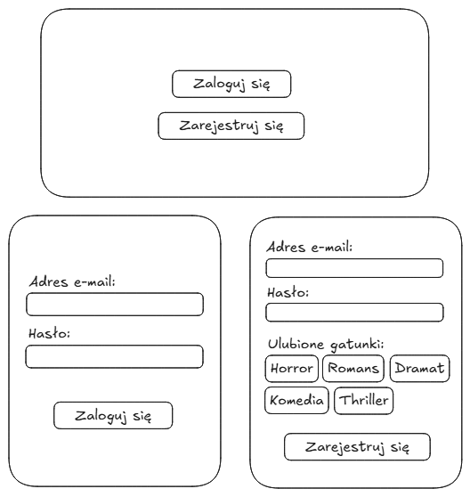
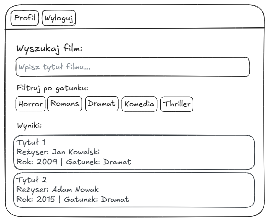
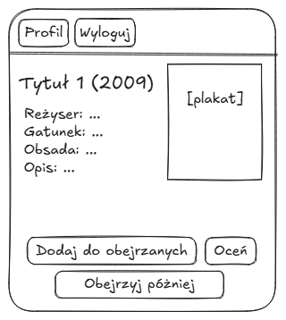
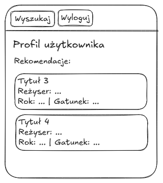
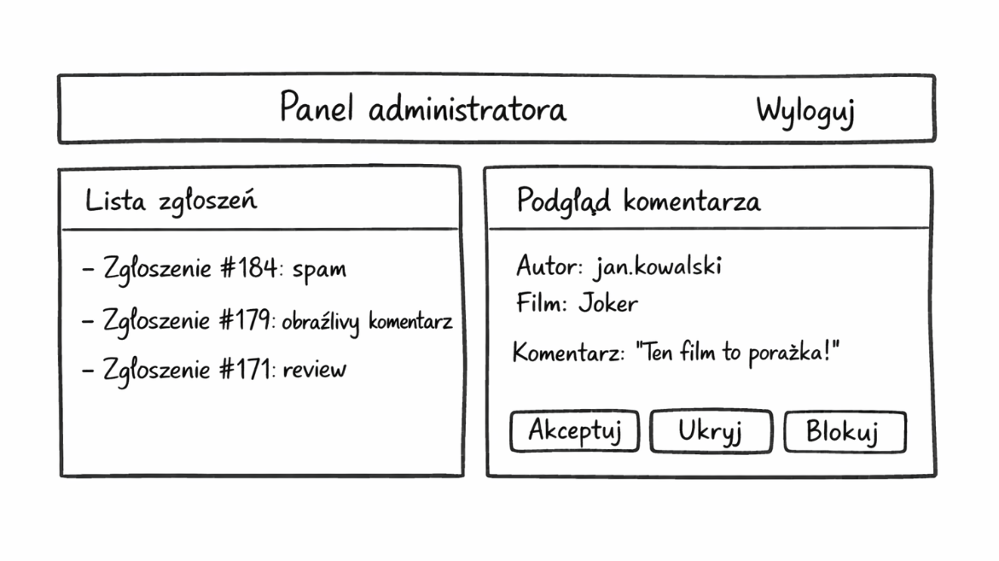

\newpage

# Temat aplikacji

**Webowy system rekomendacji filmów i zarządzania ocenami użytkowników.**

Aplikacja umożliwia użytkownikom wyszukiwanie filmów, ocenianie ich oraz otrzymywanie rekomendacji na podstawie swoich preferencji. Na podstawie zebranych ocen generowane są propozycje filmów, które mogą zainteresować użytkownika.

# Dla kogo dedykowana jest aplikacja

Aplikacja przeznaczona jest dla:

- osób oglądających filmy i chcących łatwiej znajdować nowe tytuły,
- użytkowników, którzy chcą prowadzić własną listę obejrzanych, ocenionych i zapisanych do obejrzenia filmów,
- osób poszukujących rekomendacji filmowych na podstawie swoich preferencji

System może być używany przez każdego użytkownika internetu, który chce uporządkować historię oglądanych filmów oraz otrzymywać sugestie nowych tytułów.

# Cel aplikacji

Celem aplikacji jest stworzenie systemu webowego umożliwiającego:

- gromadzenie ocen filmów przez użytkowników,
- analizę preferencji użytkownika,
- generowanie rekomendacji filmowych,
- wygodne przeglądanie i wyszukiwanie filmów.

Aplikacja ma na celu zaprezentowanie praktycznego wykorzystania technologii tworzenia aplikacji internetowych, w szczególności w zakresie przetwarzania danych użytkowników, komunikacji między klientem a serwerem oraz dynamicznej obsługi interfejsu użytkownika.

# Wymagania funkcjonalne

## Wymagania użytkowników

Użytkownicy oczekują systemu, który:

- umożliwia łatwe i intuicyjne wyszukiwanie filmów według różnych kryteriów,
- jasno komunikuje, co należy wpisać w pole wyszukiwania i jakie filtry są dostępne,
- pozwala na ocenianie filmów w prostej skali (np. gwiazdkowej),
- generuje rekomendacje dopasowane do indywidualnych preferencji,
- udostępnia historię obejrzanych, ocenionych i zapisanych do obejrzenia filmów z możliwością zarządzania,
- działa responsywnie na różnych urządzeniach,
- zapewnia przejrzysty i przyjazny interfejs użytkownika.

## Wymagania biznesowe

Z punktu widzenia biznesowego system powinien:

- gromadzić dane o preferencjach użytkowników do celów analitycznych,
- zapewniać skalowalność i stabilność działania,
- wspierać łatwe rozszerzanie funkcjonalności,
- zapewniać bezpieczeństwo danych użytkowników,
- obsługiwać duże zbiory danych filmowych wydajnie.

\newpage

## Funkcjonalności dla użytkownika

### Rejestracja i logowanie użytkownika

**Co robi użytkownik:**
Użytkownik przechodzi do panelu startowego, w którym może wybrać opcję logowania albo rejestracji. Przy logowaniu podaje adres e-mail i hasło. Przy rejestracji wpisuje adres e-mail, hasło oraz zaznacza ulubione gatunki filmowe.

**Co robi system:**
System wyświetla dwa warianty formularza w jednym panelu: logowanie i rejestrację. Waliduje dane, sprawdza unikalność adresu e-mail, generuje hash hasła i zapisuje konto w bazie danych wraz z preferowanymi gatunkami. Po poprawnym logowaniu uwierzytelnia użytkownika i przekierowuje go na stronę główną. Już po rejestracji system może generować wstępne rekomendacje na podstawie wybranych gatunków, nawet jeśli użytkownik nie ocenił jeszcze żadnego filmu.

**Schemat widoku – Rejestracja/logowanie:**

{width=70% fig-align="center"}

\newpage

### Wyszukiwanie filmów

**Co robi użytkownik:**
Użytkownik przechodzi do strony głównej, wpisuje tytuł filmu w polu wyszukiwania i może dodatkowo filtrować wyniki po gatunkach.

**Co robi system:**
System przeszukuje bazę filmów po tytule i wybranych gatunkach, a następnie wyświetla listę pasujących wyników w dolnej części strony. Każdy wynik zawiera podstawowe informacje o filmie i umożliwia przejście do jego szczegółów.

**Schematy widoków – Wyszukiwanie filmów:**

{width=90% fig-align="center"}

\newpage

### Przeglądanie szczegółów filmu

**Co robi użytkownik:**
Użytkownik klika na wybrany film z listy wyników wyszukiwania lub z sekcji na stronie głównej.

**Co robi system:**
System pobiera i wyświetla szczegółowe informacje o filmie: tytuł, rok produkcji, reżysera, obsadę, gatunki, opis fabuły, plakat oraz średnią ocenę. W dolnej części widoku udostępnia przyciski: dodanie filmu do obejrzanych, ocenienie filmu oraz zapisanie go do obejrzenia później.

**Schemat widoku – Szczegóły filmu:**

{width=70% fig-align="center"}

\newpage

### Ocenianie filmów

**Co robi użytkownik:**
Użytkownik wystawia ocenę filmu w skali od 1 do 5 gwiazdek. Może również usunąć wcześniej dodaną ocenę za pomocą dedykowanego przycisku.

**Co robi system:**
System zapisuje lub aktualizuje ocenę przypisaną do użytkownika i filmu. W przypadku usunięcia oceny usuwa ją z bazy danych i odświeża widok. Po każdej zmianie przelicza średnią ocenę filmu i uwzględnia nowe dane w rekomendacjach użytkownika.

**Schemat widoku – Ocenianie filmu:**

{width=70% fig-align="center"}

### Panel użytkownika – Aktywność i rekomendacje

**Moje filmy:**

**Co robi użytkownik:**
Użytkownik przechodzi do profilu i przegląda zakładki: obejrzane, ocenione oraz do obejrzenia. Może otwierać filmy zapisane w poszczególnych zakładkach.

**Co robi system:**
System pobiera listy filmów powiązanych z kontem użytkownika i wyświetla je w podziale na odpowiednie zakładki. Każda zakładka prezentuje filmy przypisane do danego typu aktywności użytkownika.

**Rekomendacje filmów:**

**Co robi użytkownik:**
Użytkownik przechodzi do sekcji z rekomendowanymi filmami i może otwierać proponowane tytuły.

**Co robi system:**
System analizuje historię ocen użytkownika oraz preferencje filmowe zadeklarowane podczas rejestracji. Jeśli użytkownik nie ma jeszcze żadnych ocen, rekomendacje są generowane na podstawie ulubionych gatunków wybranych przy zakładaniu konta. Wyniki są prezentowane jako lista rekomendowanych filmów dostępnych z poziomu profilu użytkownika.

**Schematy widoków – Panel użytkownika:**

{width=50%}
{width=50%}

\newpage

### Panel administratora

**Co robi administrator:**
Administrator loguje się do dedykowanego panelu administracyjnego i przegląda zgłoszenia dotyczące komentarzy oraz treści dodawanych przez użytkowników. Może filtrować komentarze wymagające uwagi, oznaczać je jako zaakceptowane, ukrywać treści nieodpowiednie lub podejmować dalsze działania moderacyjne wobec kont użytkowników.

**Co robi system:**
System udostępnia administratorowi narzędzia do nadzorowania treści publikowanych w aplikacji, w szczególności komentarzy zawierających wulgaryzmy, mowę nienawiści, spam lub inne niedozwolone treści. System rejestruje historię działań moderacyjnych i umożliwia przegląd komentarzy oznaczonych automatycznie lub zgłoszonych przez użytkowników.

**Schemat widoku – Panel administratora:**

{fig-align="center"}

\newpage

---

# Podsumowanie zakresu prac

Na podstawie wymagań funkcjonalnych można oszacować zakres prac potrzebnych do implementacji aplikacji:

1. Backend:
   - Integracja z TMDB API do pobierania danych filmowych (tytuły, plakaty, gatunki, obsada, reżyserzy).
   - Projektowanie i implementacja bazy danych relacyjnej (tabele: users, ratings, watchlist, watched_movies, user_preferences, moderation_reports) z indeksami dla wydajności.
   - Implementacja API REST dla wszystkich funkcjonalności (autentykacja, statusy filmów, oceny, rekomendacje, moderacja).
   - Implementacja algorytmu rekomendacji filmów.
   - System autentykacji i autoryzacji użytkowników z logowaniem przez adres e-mail.
   - Mechanizm walidacji danych, obsługa błędów i logowanie.
   - Paginacja i filtrowanie dla list wyników oraz panelu administracyjnego.

2. Frontend:
   - Implementacja widoków zgodnych z przedstawionymi schematami.
   - Integracja z API backendu oraz wyświetlanie danych z TMDB.
   - System nawigacji między widokami (routing).
   - Komponenty UI z możliwością wyszukiwania po tytule i filtrowania po gatunkach.
   - Obsługa stanu aplikacji (zarządzanie sesją użytkownika, listą obejrzanych, listą do obejrzenia i preferencjami gatunkowymi).

3. Testy i deployment:
   - Testy jednostkowe dla kluczowych funkcjonalności.
   - Testy integracyjne API oraz komunikacji z TMDB.
   - Testy end-to-end dla głównych ścieżek użytkownika.
   - Testy wydajnościowe dla algorytmu rekomendacji oraz testy moderacji treści.
   - Proces CI/CD dla automatycznego deploymentu.
   - Konfiguracja środowiska produkcyjnego z obsługą zmiennych środowiskowych (TMDB API key).

Dokumentacja stanowi punkt odniesienia dla dalszej realizacji projektu.
