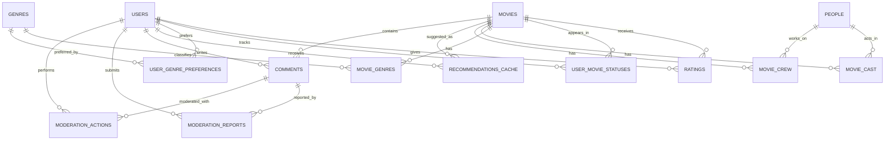

# Projekt bazy danych

## Aplikacja

Webowy system rekomendacji filmów i zarządzania ocenami użytkowników.

## Cel projektu bazy

Baza danych ma obsłużyć:

- rejestrację i logowanie użytkowników,
- przechowywanie katalogu filmów pobieranego z TMDB,
- wyszukiwanie filmów po tytule i gatunkach,
- ocenianie filmów,
- zarządzanie listą "do obejrzenia" i listą obejrzanych,
- zapisywanie preferencji gatunkowych użytkownika,
- generowanie i przechowywanie rekomendacji,
- moderację komentarzy i zgłoszeń w panelu administratora.

## Założenia techniczne

- Docelowa baza: PostgreSQL.
- Klucze główne: `uuid` dla użytkowników, `bigint` dla danych katalogowych i operacyjnych.
- Dane filmowe są synchronizowane z TMDB, dlatego tabele katalogowe przechowują także identyfikatory zewnętrzne `tmdb_id`.
- Średnia ocena filmu i liczba ocen są cache'owane w tabeli `movies`, aby przyspieszyć odczyt.
- Zakładka "ocenione" w panelu użytkownika wynika bezpośrednio z tabeli `ratings`, więc nie wymaga osobnej tabeli.

## Główne encje

- `users` - konta użytkowników i administratorów
- `genres` - słownik gatunków
- `movies` - podstawowe informacje o filmach
- `movie_genres` - relacja wiele-do-wielu film-gatunek
- `people` - osoby powiązane z filmami
- `movie_cast` - obsada
- `movie_crew` - twórcy filmu, np. reżyser
- `ratings` - oceny użytkowników
- `user_movie_statuses` - lista "do obejrzenia" i lista obejrzanych
- `user_genre_preferences` - preferencje gatunkowe użytkownika
- `recommendations_cache` - zapis ostatnio wyliczonych rekomendacji
- `comments` - komentarze użytkowników
- `moderation_reports` - zgłoszenia komentarzy
- `moderation_actions` - historia działań administratora

## Diagram relacji



## Struktura tabel

### 1. `users`

Przechowuje konta zwykłych użytkowników i administratorów.

| Kolumna | Typ | Ograniczenia | Opis |
|---|---|---|---|
| `id` | `uuid` | PK | Identyfikator użytkownika |
| `email` | `varchar(255)` | UNIQUE, NOT NULL | Login użytkownika |
| `password_hash` | `text` | NOT NULL | Hash hasła |
| `display_name` | `varchar(80)` | NULL | Nazwa wyświetlana |
| `role` | `varchar(20)` | NOT NULL, default `'user'` | `user` albo `admin` |
| `account_status` | `varchar(20)` | NOT NULL, default `'active'` | np. `active`, `suspended`, `banned` |
| `created_at` | `timestamptz` | NOT NULL | Data utworzenia |
| `updated_at` | `timestamptz` | NOT NULL | Data aktualizacji |
| `last_login_at` | `timestamptz` | NULL | Ostatnie logowanie |

### 2. `genres`

Słownik gatunków filmowych.

| Kolumna | Typ | Ograniczenia | Opis |
|---|---|---|---|
| `id` | `smallserial` | PK | Klucz techniczny |
| `tmdb_genre_id` | `integer` | UNIQUE | Id gatunku w TMDB |
| `name` | `varchar(50)` | UNIQUE, NOT NULL | Nazwa gatunku |

### 3. `movies`

Podstawowe dane filmu używane przy wyszukiwaniu i prezentacji szczegółów.

| Kolumna | Typ | Ograniczenia | Opis |
|---|---|---|---|
| `id` | `bigserial` | PK | Klucz techniczny |
| `tmdb_id` | `integer` | UNIQUE, NOT NULL | Id filmu w TMDB |
| `title` | `varchar(255)` | NOT NULL | Tytuł |
| `original_title` | `varchar(255)` | NULL | Tytuł oryginalny |
| `overview` | `text` | NULL | Opis fabuły |
| `release_date` | `date` | NULL | Data premiery |
| `runtime_minutes` | `integer` | NULL | Długość filmu |
| `poster_url` | `text` | NULL | URL plakatu |
| `backdrop_url` | `text` | NULL | URL tła |
| `original_language` | `varchar(10)` | NULL | Język oryginalny |
| `average_rating` | `numeric(3,2)` | NOT NULL, default `0.00` | Średnia ocen użytkowników |
| `ratings_count` | `integer` | NOT NULL, default `0` | Liczba ocen |
| `popularity` | `numeric(10,2)` | NULL | Popularność z TMDB |
| `created_at` | `timestamptz` | NOT NULL | Data dodania |
| `updated_at` | `timestamptz` | NOT NULL | Data aktualizacji |

### 4. `movie_genres`

Tabela pośrednia między filmami i gatunkami.

| Kolumna | Typ | Ograniczenia | Opis |
|---|---|---|---|
| `movie_id` | `bigint` | PK, FK -> `movies.id` | Film |
| `genre_id` | `smallint` | PK, FK -> `genres.id` | Gatunek |

### 5. `people`

Osoby związane z produkcją filmu.

| Kolumna | Typ | Ograniczenia | Opis |
|---|---|---|---|
| `id` | `bigserial` | PK | Klucz techniczny |
| `tmdb_id` | `integer` | UNIQUE, NOT NULL | Id osoby w TMDB |
| `full_name` | `varchar(150)` | NOT NULL | Imię i nazwisko |
| `profile_url` | `text` | NULL | Zdjęcie lub profil |

### 6. `movie_cast`

Obsada filmu.

| Kolumna | Typ | Ograniczenia | Opis |
|---|---|---|---|
| `movie_id` | `bigint` | PK, FK -> `movies.id` | Film |
| `person_id` | `bigint` | PK, FK -> `people.id` | Aktor |
| `character_name` | `varchar(150)` | NULL | Odtwarzana postać |
| `cast_order` | `smallint` | NULL | Kolejność na liście obsady |

### 7. `movie_crew`

Twórcy filmu, np. reżyser, scenarzysta, producent.

| Kolumna | Typ | Ograniczenia | Opis |
|---|---|---|---|
| `movie_id` | `bigint` | PK, FK -> `movies.id` | Film |
| `person_id` | `bigint` | PK, FK -> `people.id` | Osoba |
| `job` | `varchar(50)` | PK | Rola, np. `Director` |
| `department` | `varchar(50)` | NULL | Dział produkcji |

### 8. `ratings`

Oceny filmów wystawiane przez użytkowników.

| Kolumna | Typ | Ograniczenia | Opis |
|---|---|---|---|
| `id` | `bigserial` | PK | Klucz techniczny |
| `user_id` | `uuid` | FK -> `users.id`, NOT NULL | Autor oceny |
| `movie_id` | `bigint` | FK -> `movies.id`, NOT NULL | Oceniany film |
| `score` | `smallint` | NOT NULL, CHECK `score BETWEEN 1 AND 5` | Ocena |
| `created_at` | `timestamptz` | NOT NULL | Data utworzenia |
| `updated_at` | `timestamptz` | NOT NULL | Data aktualizacji |

Ograniczenie dodatkowe:

- `UNIQUE (user_id, movie_id)` - jeden użytkownik może wystawić jedną aktywną ocenę dla filmu.

### 9. `user_movie_statuses`

Status filmu w kontekście użytkownika.

Ta tabela zastępuje dwie osobne tabele `watchlist` i `watched_movies`.

| Kolumna | Typ | Ograniczenia | Opis |
|---|---|---|---|
| `user_id` | `uuid` | PK, FK -> `users.id` | Użytkownik |
| `movie_id` | `bigint` | PK, FK -> `movies.id` | Film |
| `status` | `varchar(20)` | NOT NULL | `watchlist` albo `watched` |
| `created_at` | `timestamptz` | NOT NULL | Data dodania |
| `updated_at` | `timestamptz` | NOT NULL | Data zmiany statusu |

Uwagi:

- film może zmienić status z `watchlist` na `watched`,
- zakładka "ocenione" jest wyliczana na podstawie `ratings`.

### 10. `user_genre_preferences`

Preferowane gatunki użytkownika wybierane przy rejestracji lub aktualizowane później.

| Kolumna | Typ | Ograniczenia | Opis |
|---|---|---|---|
| `user_id` | `uuid` | PK, FK -> `users.id` | Użytkownik |
| `genre_id` | `smallint` | PK, FK -> `genres.id` | Gatunek |
| `preference_score` | `numeric(4,2)` | NOT NULL, default `1.00` | Siła preferencji |
| `source` | `varchar(20)` | NOT NULL, default `'signup'` | np. `signup`, `explicit`, `inferred` |
| `created_at` | `timestamptz` | NOT NULL | Data dodania |
| `updated_at` | `timestamptz` | NOT NULL | Data aktualizacji |

### 11. `recommendations_cache`

Przechowuje aktualnie wyliczone rekomendacje dla użytkownika.

| Kolumna | Typ | Ograniczenia | Opis |
|---|---|---|---|
| `id` | `bigserial` | PK | Klucz techniczny |
| `user_id` | `uuid` | FK -> `users.id`, NOT NULL | Odbiorca rekomendacji |
| `movie_id` | `bigint` | FK -> `movies.id`, NOT NULL | Rekomendowany film |
| `recommendation_score` | `numeric(6,3)` | NOT NULL | Wynik algorytmu |
| `reason` | `varchar(255)` | NULL | Krótki opis powodu rekomendacji |
| `generated_at` | `timestamptz` | NOT NULL | Data wygenerowania |

Ograniczenie dodatkowe:

- `UNIQUE (user_id, movie_id)` - w cache przechowujemy jedną aktualną rekomendację danego filmu dla użytkownika.

### 12. `comments`

Komentarze użytkowników pod filmami.

Ta tabela jest potrzebna, bo panel administratora w koncepcji projektu dotyczy moderacji komentarzy.

| Kolumna | Typ | Ograniczenia | Opis |
|---|---|---|---|
| `id` | `bigserial` | PK | Klucz techniczny |
| `movie_id` | `bigint` | FK -> `movies.id`, NOT NULL | Film |
| `user_id` | `uuid` | FK -> `users.id`, NOT NULL | Autor komentarza |
| `content` | `text` | NOT NULL | Treść komentarza |
| `status` | `varchar(20)` | NOT NULL, default `'visible'` | np. `visible`, `flagged`, `hidden`, `deleted` |
| `toxicity_score` | `numeric(5,4)` | NULL | Wynik automatycznej analizy treści |
| `created_at` | `timestamptz` | NOT NULL | Data dodania |
| `updated_at` | `timestamptz` | NOT NULL | Data edycji |
| `moderated_at` | `timestamptz` | NULL | Data ostatniej moderacji |

### 13. `moderation_reports`

Zgłoszenia komentarzy przez użytkowników lub system automatyczny.

| Kolumna | Typ | Ograniczenia | Opis |
|---|---|---|---|
| `id` | `bigserial` | PK | Klucz techniczny |
| `comment_id` | `bigint` | FK -> `comments.id`, NOT NULL | Zgłaszany komentarz |
| `reporter_user_id` | `uuid` | FK -> `users.id`, NULL | Użytkownik zgłaszający, `NULL` dla zgłoszeń systemowych |
| `source` | `varchar(20)` | NOT NULL | `user` albo `system` |
| `reason_code` | `varchar(50)` | NOT NULL | np. `spam`, `hate_speech`, `vulgarity` |
| `description` | `text` | NULL | Dodatkowy opis |
| `status` | `varchar(20)` | NOT NULL, default `'new'` | np. `new`, `in_review`, `resolved`, `rejected` |
| `created_at` | `timestamptz` | NOT NULL | Data zgłoszenia |
| `reviewed_at` | `timestamptz` | NULL | Data zamknięcia zgłoszenia |

### 14. `moderation_actions`

Historia działań administratora. Pozwala odtworzyć przebieg moderacji.

| Kolumna | Typ | Ograniczenia | Opis |
|---|---|---|---|
| `id` | `bigserial` | PK | Klucz techniczny |
| `comment_id` | `bigint` | FK -> `comments.id`, NOT NULL | Komentarz, którego dotyczy akcja |
| `report_id` | `bigint` | FK -> `moderation_reports.id`, NULL | Powiązane zgłoszenie |
| `admin_user_id` | `uuid` | FK -> `users.id`, NOT NULL | Administrator |
| `action_type` | `varchar(30)` | NOT NULL | np. `approve`, `hide_comment`, `delete_comment`, `warn_user`, `suspend_user` |
| `action_note` | `text` | NULL | Notatka administratora |
| `created_at` | `timestamptz` | NOT NULL | Data wykonania akcji |

## Najważniejsze relacje biznesowe

### Użytkownik i filmy

- użytkownik może wystawić wiele ocen,
- użytkownik może mieć wiele preferowanych gatunków,
- użytkownik może mieć status filmu `watchlist` lub `watched`,
- użytkownik otrzymuje wiele rekomendacji.

### Film i metadane

- film może należeć do wielu gatunków,
- film może mieć wielu aktorów i wielu twórców,
- film może mieć wiele ocen i komentarzy.

### Moderacja

- komentarz może mieć wiele zgłoszeń,
- administrator może wykonać wiele działań moderacyjnych,
- zgłoszenia i akcje tworzą historię potrzebną w panelu admina.

## Indeksy

Minimalny zestaw indeksów:

```sql
CREATE UNIQUE INDEX ux_users_email ON users(email);
CREATE UNIQUE INDEX ux_movies_tmdb_id ON movies(tmdb_id);
CREATE UNIQUE INDEX ux_ratings_user_movie ON ratings(user_id, movie_id);
CREATE UNIQUE INDEX ux_user_movie_statuses_user_movie ON user_movie_statuses(user_id, movie_id);
CREATE UNIQUE INDEX ux_user_genre_preferences_user_genre ON user_genre_preferences(user_id, genre_id);
CREATE UNIQUE INDEX ux_recommendations_cache_user_movie ON recommendations_cache(user_id, movie_id);

CREATE INDEX ix_movie_genres_genre_movie ON movie_genres(genre_id, movie_id);
CREATE INDEX ix_ratings_movie_id ON ratings(movie_id);
CREATE INDEX ix_user_movie_statuses_user_status ON user_movie_statuses(user_id, status);
CREATE INDEX ix_recommendations_cache_user_score ON recommendations_cache(user_id, recommendation_score DESC);
CREATE INDEX ix_comments_movie_status_created ON comments(movie_id, status, created_at DESC);
CREATE INDEX ix_moderation_reports_status_created ON moderation_reports(status, created_at);
```

Dla szybkiego wyszukiwania po tytule w PostgreSQL warto dodać:

```sql
CREATE EXTENSION IF NOT EXISTS pg_trgm;
CREATE INDEX ix_movies_title_trgm ON movies USING gin (title gin_trgm_ops);
```

## Logika aplikacyjna wynikająca z modelu

### Rejestracja

Podczas rejestracji:

1. powstaje rekord w `users`,
2. zapisywane są wybrane gatunki w `user_genre_preferences`.

### Ocenianie filmu

Podczas dodania lub zmiany oceny:

1. system zapisuje rekord w `ratings`,
2. aktualizuje `movies.average_rating` i `movies.ratings_count`,
3. może przebudować wpisy w `recommendations_cache`.

### Panel użytkownika

Zakładki można zbudować bez dodatkowych tabel:

- "obejrzane" z `user_movie_statuses WHERE status = 'watched'`,
- "do obejrzenia" z `user_movie_statuses WHERE status = 'watchlist'`,
- "ocenione" z `ratings`.

### Moderacja

Przebieg moderacji:

1. użytkownik lub system tworzy wpis w `moderation_reports`,
2. administrator przegląda zgłoszenie,
3. decyzja zapisywana jest w `moderation_actions`,
4. status komentarza zmienia się w `comments.status`.

## MVP a rozwój projektu

Jeśli projekt ma być realizowany etapami, można zacząć od wersji MVP:

- `users`
- `genres`
- `movies`
- `movie_genres`
- `ratings`
- `user_movie_statuses`
- `user_genre_preferences`

W drugim etapie można dodać:

- `people`
- `movie_cast`
- `movie_crew`
- `recommendations_cache`
- `comments`
- `moderation_reports`
- `moderation_actions`

## Podsumowanie

Ten model bazy danych pokrywa wszystkie wymagania opisane w `docs/app-concept.qmd` i pozostaje rozszerzalny. Najważniejsza decyzja projektowa to:

- trzymanie danych katalogowych filmów osobno od danych aktywności użytkownika,
- wyliczanie zakładki "ocenione" bez osobnej tabeli,
- połączenie list "do obejrzenia" i "obejrzane" w jednej tabeli statusów,
- wydzielenie części moderacyjnej tak, aby panel administratora miał pełną historię działań.
