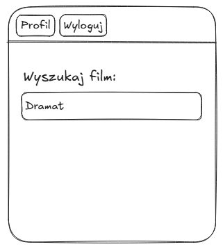
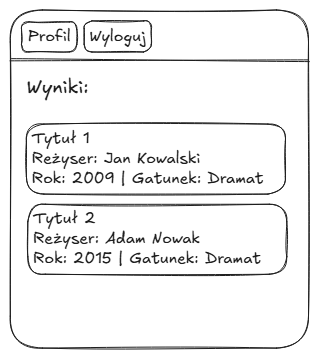
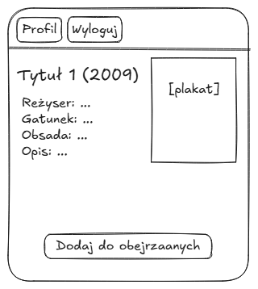
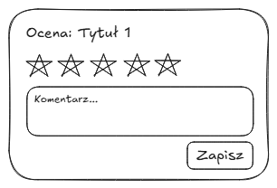
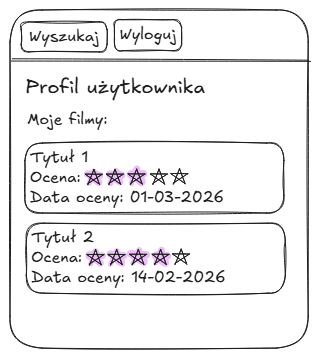

\newpage

# Temat aplikacji

**Webowy system rekomendacji filmów i zarządzania ocenami użytkowników.**

Aplikacja umożliwia użytkownikom wyszukiwanie filmów, ocenianie ich oraz otrzymywanie rekomendacji na podstawie swoich preferencji. Na podstawie zebranych ocen generowane są propozycje filmów, które mogą zainteresować użytkownika.

# Dla kogo dedykowana jest aplikacja

Aplikacja przeznaczona jest dla:

- osób oglądających filmy i chcących łatwiej znajdować nowe tytuły,
- użytkowników, którzy chcą prowadzić własną listę ocenionych filmów,
- osób poszukujących rekomendacji filmowych na podstawie swoich preferencji

System może być używany przez każdego użytkownika internetu, który chce uporządkować historię oglądanych filmów oraz otrzymywać sugestie nowych tytułów.

# Cel aplikacji

Celem aplikacji jest stworzenie systemu webowego umożliwiającego:

- gromadzenie ocen filmów przez użytkowników,
- analizę preferencji użytkownika,
- generowanie rekomendacji filmowych,
- wygodne przeglądanie i wyszukiwanie filmów.

Aplikacja ma na celu zaprezentowanie praktycznego wykorzystania technologii tworzenia aplikacji internetowych, w szczególności w zakresie przetwarzania danych użytkowników, komunikacji między klientem a serwerem oraz dynamicznej obsługi interfejsu użytkownika.

# Wymagania funkcjonalne

## Wymagania użytkowników

Użytkownicy oczekują systemu, który:

- umożliwia łatwe i intuicyjne wyszukiwanie filmów według różnych kryteriów,
- pozwala na ocenianie filmów w prostej skali (np. gwiazdkowej),
- generuje rekomendacje dopasowane do indywidualnych preferencji,
- udostępnia historię ocenionych filmów z możliwością zarządzania,
- działa responsywnie na różnych urządzeniach,
- zapewnia przejrzysty i przyjazny interfejs użytkownika.

## Wymagania biznesowe

Z punktu widzenia biznesowego system powinien:

- gromadzić dane o preferencjach użytkowników do celów analitycznych,
- zapewniać skalowalność i stabilność działania,
- wspierać łatwe rozszerzanie funkcjonalności,
- zapewniać bezpieczeństwo danych użytkowników,
- obsługiwać duże zbiory danych filmowych wydajnie.

\newpage

## Funkcjonalności dla użytkownika

### Rejestracja i logowanie użytkownika

**Co robi użytkownik:**
Nowy użytkownik wypełnia formularz rejestracyjny (login, hasło). Zarejestrowany użytkownik loguje się do istniejącego konta, wprowadzając login i hasło.

**Co robi system:**
System waliduje dane, sprawdza unikalność loginu, generuje hash hasła i zapisuje konto w bazie danych. Przy logowaniu weryfikuje dane i uwierzytelnia użytkownika, przekierowując go na stronę główną.

**Schemat widoku – Rejestracja/logowanie:**

{width=70% fig-align="center"}

\newpage

### Wyszukiwanie filmów

**Co robi użytkownik:**
Użytkownik wpisuje frazę wyszukiwania w polu wyszukiwania na stronie głównej. Może szukać po tytule, reżyserze, obsadzie lub gatunku. Dodatkowo może skorzystać z filtrów (rok produkcji, gatunek) oraz sortowania wyników.

**Co robi system:**
System przeszukuje bazę filmów i zwraca listę pasujących wyników zawierającą plakat, tytuł, rok produkcji, gatunek oraz średnią ocenę.

**Schematy widoków – Wyszukiwanie filmów:**

{width=50%}
{width=50%}

\newpage

### Przeglądanie szczegółów filmu

**Co robi użytkownik:**
Użytkownik klika na wybrany film z listy wyników wyszukiwania lub z sekcji na stronie głównej.

**Co robi system:**
System pobiera i wyświetla szczegółowe informacje o filmie: tytuł, rok produkcji, reżysera, obsadę, gatunki, opis fabuły, plakat oraz średnią ocenę. Jeśli użytkownik jest zalogowany, system umożliwia mu ocenienie filmu lub wyświetla jego dotychczasową ocenę.

**Schemat widoku – Szczegóły filmu:**

{width=70% fig-align="center"}

\newpage

### Ocenianie filmów

**Co robi użytkownik:**
Użytkownik wybiera ocenę w skali od 1 do 5 gwiazdek na stronie szczegółów filmu. Może również zmienić lub usunąć istniejącą ocenę.

**Co robi system:**
System zapisuje lub aktualizuje ocenę w bazie danych przypisaną do użytkownika i filmu, a następnie przelicza średnią ocenę filmu. Po zapisie system odświeża widok, aby pokazać zaktualizowaną ocenę.

**Schemat widoku – Ocenianie filmu:**

{width=70% fig-align="center"}

### Panel użytkownika – Oceny i rekomendacje

**Moje ocenione filmy:**

**Co robi użytkownik:**
Użytkownik przechodzi do panelu użytkownika i wybiera sekcję "Moje filmy". Może przeglądać listę ocenionych filmów, sortować je oraz filtrować według gatunków. Może również edytować lub usunąć dowolną ocenę.

**Co robi system:**
System pobiera listę filmów ocenionych przez użytkownika i wyświetla ją w postaci listy z tytułami, ocenami i datami. Lista jest paginowana dla wydajności.

**Rekomendacje filmów:**

**Co robi użytkownik:**
Użytkownik przechodzi do sekcji "Rekomendacje" w panelu użytkownika, gdzie przegląda spersonalizowane propozycje filmów.

**Co robi system:**
System analizuje historię ocen użytkownika oraz preferencje filmowe. Na podstawie zebranych danych identyfikuje filmy, które mogą odpowiadać gustom użytkownika, i oblicza wskaźnik dopasowania. Wyniki są sortowane i prezentowane jako lista rekomendacji z procentowym dopasowaniem.

**Schematy widoków – Panel użytkownika:**

{width=50%}
{width=50%}

---

# Podsumowanie zakresu prac

Na podstawie wymagań funkcjonalnych można oszacować zakres prac potrzebnych do implementacji aplikacji:

1. Backend:
   - Integracja z TMDB API do pobierania danych filmowych (tytuły, plakaty, gatunki, obsada, reżyserzy).
   - Projektowanie i implementacja bazy danych relacyjnej (tabele: users, ratings, user_preferences) z indeksami dla wydajności.
   - Implementacja API REST dla wszystkich funkcjonalności (autentykacja, oceny, rekomendacje).
   - Implementacja algorytmu rekomendacji filmów.
   - System autentykacji i autoryzacji użytkowników.
   - Mechanizm walidacji danych, obsługa błędów i logowanie.
   - Paginacja i filtrowanie dla list wyników.

2. Frontend:
   - Implementacja widoków zgodnych z przedstawionymi schematami.
   - Integracja z API backendu oraz wyświetlanie danych z TMDB.
   - System nawigacji między widokami (routing).
   - Komponenty UI z możliwością wyszukiwania i filtrowania.
   - Obsługa stanu aplikacji (zarządzanie sesją użytkownika, ulubione filmy).

3. Testy i deployment:
   - Testy jednostkowe dla kluczowych funkcjonalności.
   - Testy integracyjne API oraz komunikacji z TMDB.
   - Testy end-to-end dla głównych ścieżek użytkownika.
   - Testy wydajnościowe dla algorytmu rekomendacji.
   - Proces CI/CD dla automatycznego deploymentu.
   - Konfiguracja środowiska produkcyjnego z obsługą zmiennych środowiskowych (TMDB API key).

Dokumentacja stanowi punkt odniesienia dla dalszej realizacji projektu.
