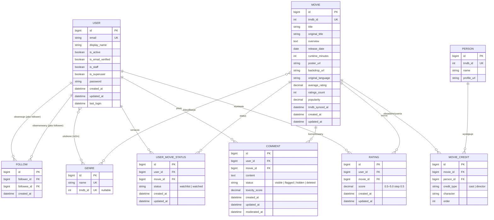

# Baza danych

Aster używa **SQLite** w środowisku developerskim oraz
**PostgreSQL**.

## Diagram ERD

## Tabele

### `accounts_user`

| Kolumna | Typ | Uwagi |
|---|---|---|
| `id` | bigint PK | |
| `email` | varchar UNIQUE | login + identyfikator |
| `display_name` | varchar(120) | opcjonalna nazwa wyświetlana |
| `is_active` | bool | `False` do momentu aktywacji e-maila |
| `is_email_verified` | bool | redundantna z `is_active`, użyteczna w przyszłej moderacji |
| `is_staff`, `is_superuser` | bool | dostęp do `/admin/` |
| `password` | varchar | hash PBKDF2 |
| `created_at`, `updated_at` | datetime | audyt |

### `accounts_genre`

> **Uwaga historyczna:** model `Genre` został przeniesiony z `accounts`
> do `movies` w migracji `accounts/0003_relocate_genre_to_movies.py`,
> ale tabela zachowała nazwę `accounts_genre` (`db_table` w meta) by
> uniknąć zbędnego RENAME.

| Kolumna | Typ | Uwagi |
|---|---|---|
| `id` | bigint PK | |
| `name` | varchar(50) UNIQUE | polska nazwa gatunku |
| `tmdb_id` | int UNIQUE NULL | identyfikator z TMDB; `NULL` = lokalny gatunek |

### `movies_movie`

Główna tabela katalogowa. Zsynchronizowana z TMDB przez `tmdb_id`.

| Kolumna | Typ | Uwagi |
|---|---|---|
| `id` | bigint PK | |
| `tmdb_id` | int UNIQUE | identyfikator z TMDB |
| `title`, `original_title` | varchar(255) | |
| `overview` | text | |
| `release_date` | date | nullable |
| `runtime_minutes` | int | nullable |
| `poster_url`, `backdrop_url` | varchar(500) | URL-e CDN TMDB |
| `original_language` | varchar(10) | ISO-639-1 |
| **`average_rating`** | decimal(3,2) | **cache** średniej z `ratings` |
| **`ratings_count`** | int | **cache** liczby ratingów |
| `popularity` | decimal(10,2) | z TMDB |
| `tmdb_synced_at` | datetime | ostatnia synchronizacja |
| `created_at`, `updated_at` | datetime | |

### `movies_rating`

Ocena użytkownika. Półgwiazdkowa precyzja.

| Kolumna | Typ | Uwagi |
|---|---|---|
| `id` | bigint PK | |
| `user_id` | bigint FK → user | ON DELETE CASCADE |
| `movie_id` | bigint FK → movie | ON DELETE CASCADE |
| `score` | decimal(2,1) | 0,5 ≤ score ≤ 5,0; krok 0,5 |
| `created_at`, `updated_at` | datetime | |

- **`UniqueConstraint(user, movie)`** — jedna ocena na film na użytkownika.
- **`CheckConstraint`** — score między 0,5 a 5,0 (krok pilnowany przez walidator formularza, nie przez DB).

### `movies_usermoviestatus`

Lista „do obejrzenia" / „obejrzane" w jednej tabeli. Pole `status`
przełącza stan.

| Kolumna | Typ | Uwagi |
|---|---|---|
| `id` | bigint PK | |
| `user_id` | bigint FK → user | |
| `movie_id` | bigint FK → movie | |
| `status` | varchar(20) | `'watchlist'` lub `'watched'` |

- **`UniqueConstraint(user, movie)`** — jeden status na film na użytkownika; przejście `watchlist` → `watched` to UPDATE.

### `movies_comment`

Komentarze pod filmem. Pola `toxicity_score` i statusy
`flagged`/`hidden` są przygotowane na przyszłą wersję.

| Kolumna | Typ | Uwagi |
|---|---|---|
| `id` | bigint PK | |
| `user_id` | bigint FK → user | |
| `movie_id` | bigint FK → movie | |
| `content` | text(2000) | |
| `status` | varchar(20) | `visible` / `flagged` / `hidden` / `deleted` |
| `toxicity_score` | decimal(5,4) | nullable (rezerwacja na ver_2) |
| `created_at`, `updated_at` | datetime | |
| `moderated_at` | datetime | nullable |

### `movies_person` i `movies_moviecredit`

Obsada i reżyseria z TMDB.

`movies_person` — jedna osoba (aktor lub reżyser).

| Kolumna | Typ | Uwagi |
|---|---|---|
| `tmdb_id` | int UNIQUE | |
| `name` | varchar(255) | |
| `profile_url` | varchar(500) | URL zdjęcia z TMDB |

`movies_moviecredit` — łącznik m2m z dodatkowymi atrybutami.

| Kolumna | Typ | Uwagi |
|---|---|---|
| `movie_id` | bigint FK | |
| `person_id` | bigint FK | |
| `credit_type` | varchar(20) | `cast` lub `director` |
| `character` | varchar(255) | tylko dla cast |
| `order` | int | kolejność na liście |

- **`UniqueConstraint(movie, person, credit_type)`** — bez duplikatów.

### `community_follow`

Relacja „follower → followee" zasilająca feed znajomych w
[`community/services.build_feed_groups`](https://github.com/agatav13/aster/blob/main/community/services.py).

| Kolumna | Typ | Uwagi |
|---|---|---|
| `id` | bigint PK | |
| `follower_id` | bigint FK → user | obserwujący; ON DELETE CASCADE |
| `followee_id` | bigint FK → user | obserwowany; ON DELETE CASCADE |
| `created_at` | datetime | używane do sortowania w listingu „znajomi" |

- **`UniqueConstraint(follower, followee)`** (`uq_follow_pair`) — jedna relacja na parę.
- **`CheckConstraint(follower != followee)`** (`ck_follow_not_self`) — blokuje self-follow.
- Indeksy `(follower, -created_at)` i `(followee, -created_at)` — wspierają zapytania feedu („kogo obserwuję") i listy followers (panel profilu publicznego).
