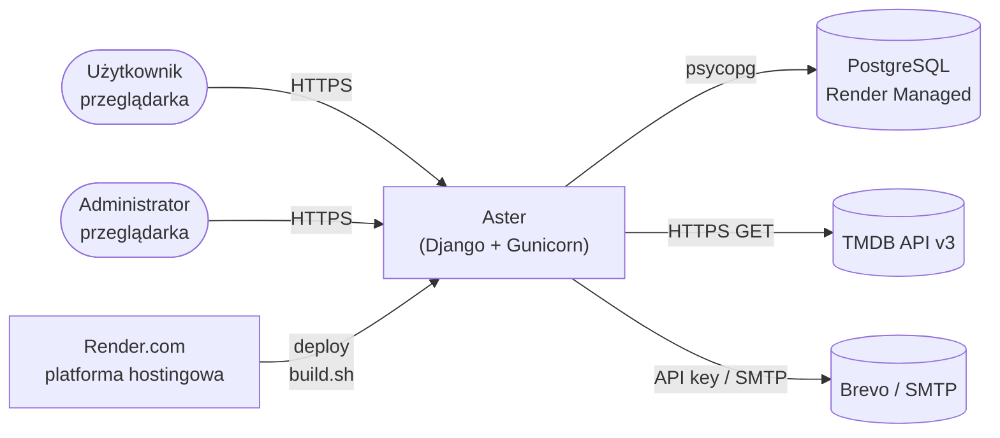
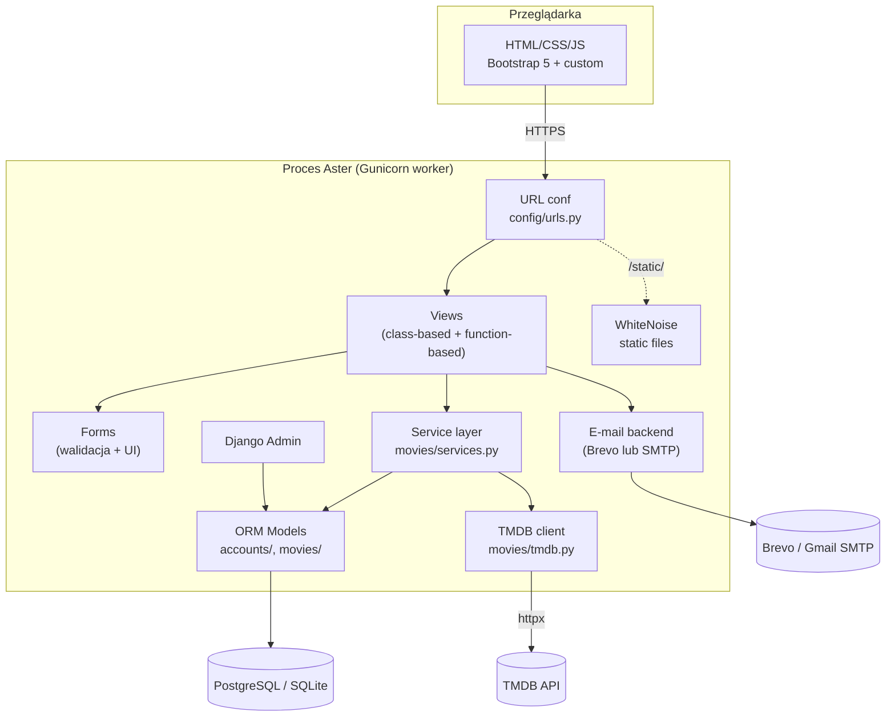

# Architektura systemu

Aster to klasyczna **trójwarstwowa aplikacja monolityczna** zbudowana
w Django. Warstwy są wyraźnie rozdzielone, ale działają w jednym
procesie WSGI.

## Diagram kontekstu (poziom 1)

## Diagram komponentów (poziom 2)

## Warstwy

### 1. Prezentacja

- **Szablony Django** w `templates/`.
- **Bootstrap 5** + autorski CSS (`static/css/`).
- **JavaScript progresywny** (`static/js/`) — modal oceny, toggle
  „pokaż więcej gatunków". Aplikacja działa bez JS w trybie minimalnym.

### 2. Logika aplikacji

- **Views** — cienka warstwa, deleguje większość pracy do serwisów. Stosujemy mieszankę class-based (`TemplateView`, `FormView`, `UpdateView`) i function-based (akcje POST `update_status`, `update_rating`, `create_comment`, `delete_comment`).
- **Forms** — walidacja danych z GET/POST oraz cleanup (np. normalizacja e-maila).
- **Services** (`movies/services.py`, `accounts/utils.py`) — całość logiki domenowej: cache średnich ocen, integracja z TMDB, wysyłka maili aktywacyjnych, transakcyjność przy ratingach i statusach.

### 3. Dane

- **ORM Django** mapuje modele (`accounts.User`, `movies.Movie`, `movies.Rating`, `movies.Comment`, `movies.UserMovieStatus`, `movies.Person`, `movies.MovieCredit`, `movies.Genre`) na tabele PostgreSQL/SQLite.
- **Migracje** w `accounts/migrations/`, `movies/migrations/` — w tym data migration `0003_seed_all_tmdb_genres.py` zapełniający słownik gatunków.
- **Kompletny opis schematu** w [Architektura → Baza danych](database.md).
