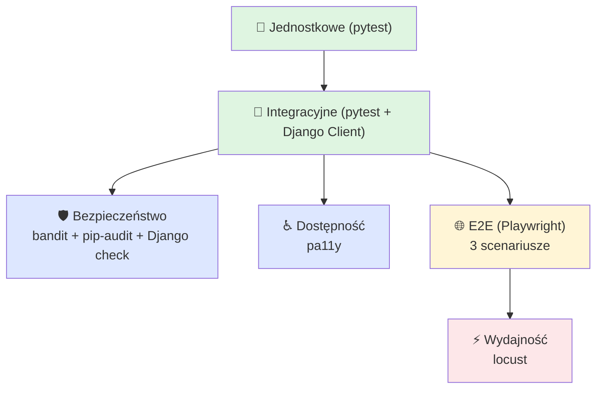

# Strategia testów

Aster stosuje pięciowarstwową strategię testów inspirowaną klasyczną
piramidą testową — najwięcej testów na dole (szybkie, tanie),
najmniej na górze (wolne, drogie, ale realistyczne).

## Warstwy

### Testy jednostkowe

- **Definicja:** sprawdzają jeden moduł / jedną funkcję w izolacji od bazy i sieci.
- **Narzędzie:** `pytest`.
- **Lokalizacja:** `accounts/tests.py`, `core/tests.py`, `movies/tests.py`.

### Testy integracyjne

- **Definicja:** weryfikują współpracę widoków, formularzy, ORM i bazy danych.
- **Narzędzie:** `pytest-django` + Django `Client` (HTTP-jak w-procesie).
- **Lokalizacja:** te same pliki co jednostkowe — pytest-django wybiera markery i fixtury.

### Testy end-to-end (E2E)

- **Definicja:** symulacja prawdziwego użytkownika w przeglądarce; sprawdza ścieżki happy-path z pełnym frontendem (HTML + JS + Bootstrap modal).
- **Narzędzie:** `pytest-playwright` + Chromium headless.
- **Lokalizacja:** `tests/e2e/`.
- **Scenariusze (mapa 1:1 ze ścieżkami użytkownika):**
    1. Rejestracja → e-mail → aktywacja → logowanie (`test_register_login.py`)
    2. Przeglądanie → ocena 4★ → komentarz (`test_browse_rate_comment.py`)
    3. Watchlist → watched (`test_watchlist.py`)
- **Uruchamianie:** `DJANGO_ALLOW_ASYNC_UNSAFE=true uv run pytest tests/e2e -m e2e`
- **CI:** `.github/workflows/e2e.yml` — push do `main` i PR do `main`.

### Testy wydajnościowe

- **Definicja:** ocena czasów odpowiedzi i przepustowości pod obciążeniem.
- **Narzędzie:** `locust`.
- **Lokalizacja:** `tests/perf/locustfile.py`.
- **Trzy ważone profile użytkowników:**
    - `AnonymousBrowser` (waga 70%) — `/`, `/movies/`, losowy `/movies/<id>/`
    - `LoggedInBrowser` (waga 25%) — login + browse + profil
    - `Searcher` (waga 5%) — `/movies/?q=<query>`
- **Cele:** p95 < 500 ms, < 1% błędów, 50 użytkowników jednocześnie przez 5 min.
- **Cel uruchamiania:** lokalny gunicorn (1 worker, jak na Render).
- **CI:** brak — uruchamiane ręcznie (CI runners są zbyt zmienne dla wiarygodnych liczb perfowych).

### Testy bezpieczeństwa

Trzy automatyczne skanery uruchamiane na każdym PR:

| Narzędzie | Co sprawdza | Próg blokujący |
|---|---|---|
| `bandit -r` | wzorce niebezpiecznego kodu Python (eval, hardcoded passwords, weak crypto) | severity ≥ medium |
| `pip-audit` | znane CVE w zależnościach z PyPI Advisory DB | dowolne znalezisko |
| `manage.py check --deploy --fail-level WARNING` | konfiguracja produkcyjna Django (HSTS, secure cookies, SSL redirect…) | dowolne ostrzeżenie |

### Testy dostępności

- **Narzędzie:** `pa11y` (HTML_CodeSniffer, standard WCAG2AA).
- **Strony pokryte:** `/auth/login/`, `/auth/register/`, `/movies/`, `/movies/<id>/`.
- **Uruchamianie:** ręcznie / przed wydaniem (procedura w [Raportach](reports.md#dostepnosc)).

## Polityka jakości

- **Każdy PR musi przechodzić** workflowy `CI` (lint + type + unit) i `Security`.
- **PR do `main`** dodatkowo przechodzą `E2E`.
- **`main`** automatycznie buduje i deployuje dokumentację (`Docs` workflow).
- **Statyczna analiza** uruchamiana lokalnie przez pre-commit (`ruff`, `ty`).
- **Pokrycie kodu** raportowane w PR (`pytest --cov`); brak twardego progu — tracimy go celowo świadomie, bo wymuszenie 100% prowadzi do bezsensownych testów.
