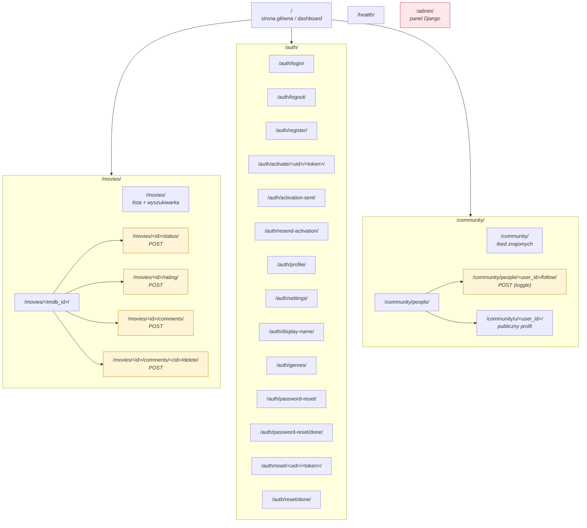

# Mapa serwisu

Mapa pokazuje wszystkie publiczne adresy aplikacji oraz wymagany
poziom dostępu.

## Drzewo URL

## Mapowanie do plików

| Sekcja | Plik URL conf |
|---|---|
| `/` | [`core/urls.py`](https://github.com/agatav13/aster/blob/main/core/urls.py) |
| `/auth/...` | [`accounts/urls.py`](https://github.com/agatav13/aster/blob/main/accounts/urls.py) |
| `/movies/...` | [`movies/urls.py`](https://github.com/agatav13/aster/blob/main/movies/urls.py) |
| `/community/...` | [`community/urls.py`](https://github.com/agatav13/aster/blob/main/community/urls.py) |
| `/admin/`, `/health/`, root include | [`config/urls.py`](https://github.com/agatav13/aster/blob/main/config/urls.py) |

> **Uwaga:** sekcja `/community/` jest w pełni działająca. Feed
> znajomych i profile publiczne są zasilane modelem
> [`community.Follow`](https://github.com/agatav13/aster/blob/main/community/models.py)
> oraz serwisem
> [`build_feed_groups`](https://github.com/agatav13/aster/blob/main/community/services.py),
> który łączy ratingi i statusy „watched" obserwowanych użytkowników.
> Akcja `POST /community/people/<user_id>/follow/` jest idempotentnym
> toggle’em. Kuratorowane listy społecznościowe pozostają na roadmapie.
